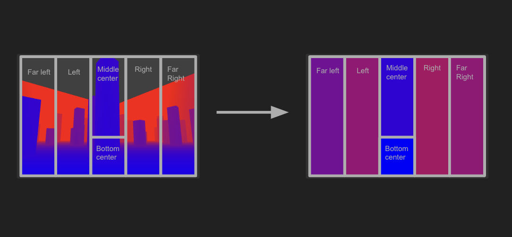
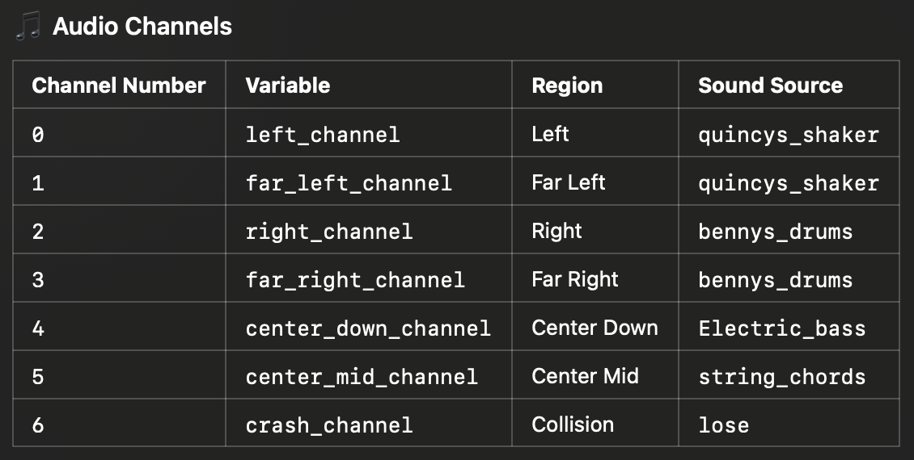
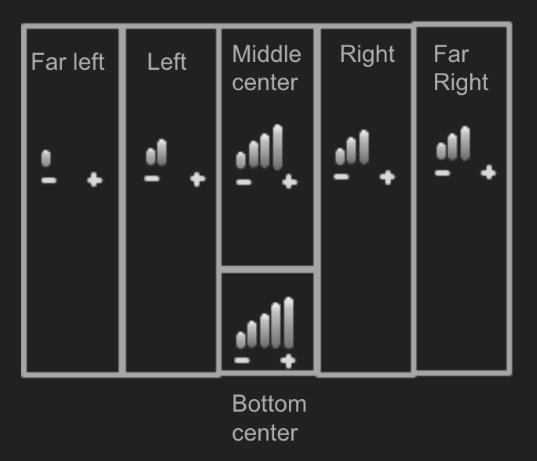

Installation:
Python version 3.10.16

Package versions:
- numpy 2.2.1
- mss 10.0.0
- scipy 1.14.1
- pygame 2.6.1
- ursina 7.0.0

Overview:

This project is a 3D first-person game built with the Ursina game engine. The game features spatial audio effects powered by Pygame and dynamic screen depth data processed using mss and NumPy.

In the game, the player, who supposed to play blindfolded or with their eyes closed, navigates through a 3D environment filled with obstacles while experiencing real-time spatial audio feedback based on screen depth mapping.

Known Issues:
- Ensure that all sound files are present in the music_3 folder.
- The game requires a consistent screen resolution(1280x960) for optimal performance.

Gameplay and rules:
- First-Person Perspective: Explore the environment using a first-person controller with WASD for movement and the mouse to look around (Q to quit game)
- Random Obstacles: Each game session generates 100 obstacles of random height and position.
- Collision Detection: Colliding with walls or obstacles triggers a sound and restarts the game.
- Reset: After surviving 2 minutes, the map will reset.

Code Explained:
Depth Mapping:
1. Screen Capturing: The game window is continuously captured in the background with mss screenshots
2. Data Analysis: The depth map is extracted and divided into spatial sections using scipy.ndimage.zoom (far left, left, middle to upper center or just mid center, bottom center, right, and far right).

Audio Cues:
1. Channels: Each section maps to an audio channel.
2. The volume of each audio channel adjusts based on the average depth detected in its region (a closer obstacle generates a louder audio cue, reflecting the virtual environment)

Licence:
    - This project is licensed under the MIT License.

Contact:
If you have any questions please contact seanjiang2009@gmail.com

